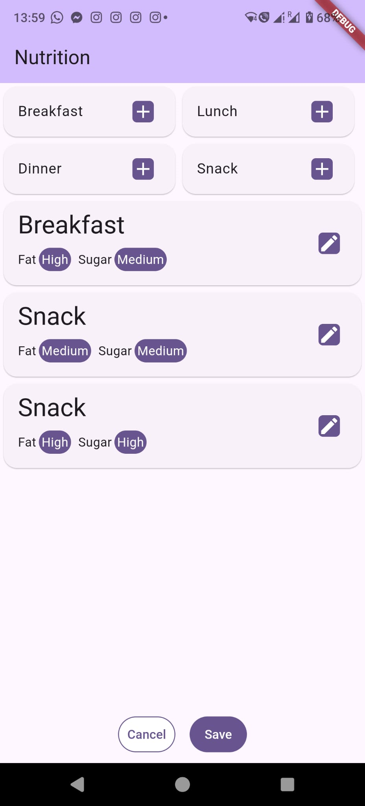
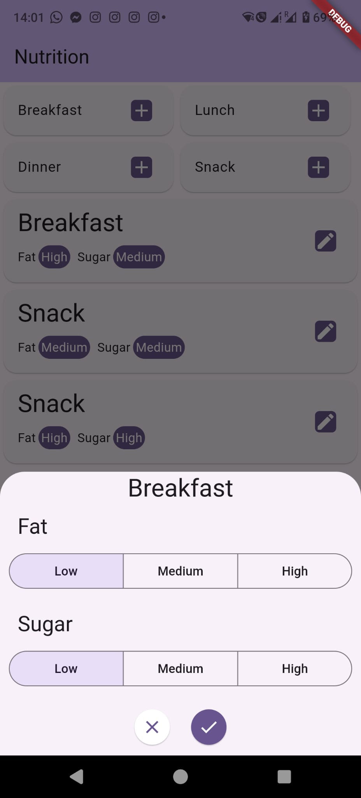

# Meal Tracker

A challenge project developed as part of a job application.
It was created from scratch.

## Getting Started

Once Flutter is fully installed on your machine and you have already taken the proper steps for iOS or Android.
I recommend following these step to test the app:
Clone the repo:
- Move your command line interface to the folder where you want to clone the repo
- git clone https://github.com/Dereumaux-Adrien/meal_tracker
  or
- gh repo clone Dereumaux-Adrien/meal_tracker

Install the app on your connected device:
- Move your command line interface inside the meal_tracker folder
- flutter clean
- flutter run

This app has been developed with with the Android Toolbox, please feel free to contact me if it doesn't run on iOS.

## Functionalities

The app allows to keep track of the meals taken during a day.

The main screen of the app is the nutrition screen.

From top to bottom, the nutrition screen contains:
- Four buttons that allow the user to start the creation of a new meal of the selected type, opens a bottom drawer to offer details options.
- A list of the already created meals, starts empty, then will contain the meals with their details and allow for their update by also opening the bottom drawer.
- Two buttons
  - A cancel button that allows to stop our existing changes and reload the previously saved state of nutrition.
  - A save button that allows to save the existing changes into the database.

The bottom drawer (also called bottom sheet)

From top to bottom, it contains:
- The name of the selected type of meal.
- A selector for which level of fat the meal contained.
- A selector for which level of sugar the meal contained.
- Two buttons
  - A X button to cancel the creation or update of the meal.
  - A checkmark button to validate the creation or update of the meal.

Restarting the app doesn't lose the saved meals. Please don't forget to save changes into the database.
It should be noted that this version of the app saves the meals separately per day.
A day selection was not yet included in the app. It still means that the meals list would be a new one the next day, but the old one is kept in the database.
Changing the date of the phone and reloading the database (restart the app or use the cancel button) allows to check the other saved list from different days.

## Technologies

For this project, I used the following techs:
- Flutter and Dart.
- The flutter_bloc package in particular a Cubit to manage the application's states and build the elements depending on these.
- The hive, isar_flutter_libs and path_provider to use the Hive NoSQL database as simply as possible.
- The intl package to make data transfer with the database simpler.

## Code plan

Under the lib folder, you can find:
- blocs, where I defined my BLoCs (here a Cubit) which are managing the sates of my app.
- components, where I define the sub components I use for the interface.
- models, where I define the different models (data types) I use in the app and their methods.
- screens, where I define my main screen/pages.
- services, where I define access to other functions like database access or auth services